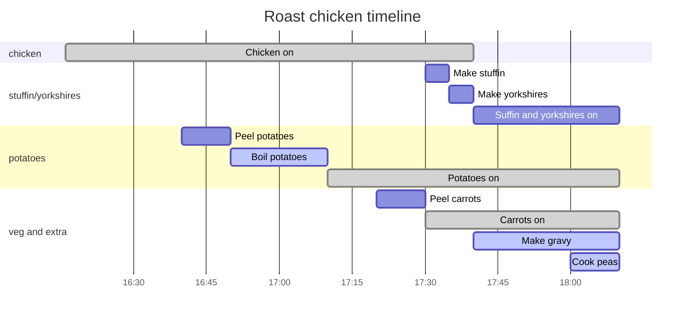

[[Alfredo]]
[[Carbonara]]
[[Fish Pie]]
[[Paella]]
[[Oven Risotto]]
[[SweetChilliStirFry]]

```mermaid
gantt
	title Roast chicken timeline
    dateFormat HH:mm
    axisFormat %H:%M

	section chicken
    Chicken on: done, a, 16:16, 84m

	section stuffin/yorkshires
    Make stuffin: b, 17:30, 5m
    Make yorkshires: c, after b, 5m
    Suffin and yorkshires on: d, after c, 30m

	section potatoes
    Peel potatoes: e, 16:40, 10m
    Boil potatoes: active, f, after e, 20m
    Potatoes on: done, g, after f, 1h
	
	section veg and extra
	Peel carrots: h, 17:20, 10m
	Carrots on: done, i, after h, 40m
	Make gravy: active, after a, 30m
	Cook peas: active, 18:00, 10m
	
```

